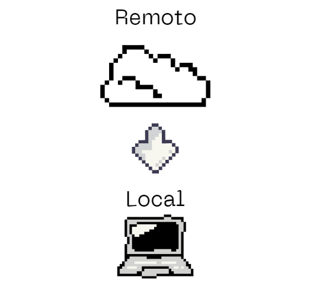
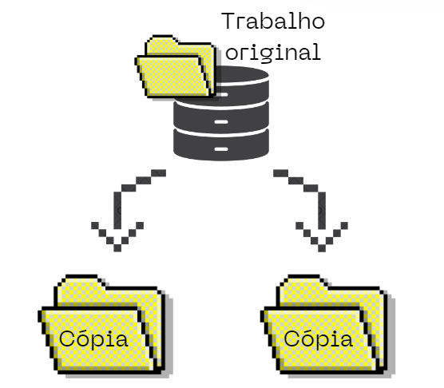

!!! example "[Clique aqui](https://youtu.be/kiTIJApIrvk) para acessar a gravação da aula Introdução ao Git e GitHub"

## O que é controle de versão?

Controle de versão é um sistema que registra alterações no desenvolvimento de software, permitindo que a equipe acesse o histórico de versões anteriores, recupere versões específicas e entenda mudanças feitas por outros. 

Ele facilita o trabalho em equipe e individual, possibilitando o registro de versões, codificação simultânea e integração segura e documentada de trabalhos. 

Um dos sistemas mais conhecidos e utilizados para controle de versão é o Git que, em conjunto com o GitHub se tornam ferramentas poderosas e práticas para colaboração e armazenamento de projetos de software.

## Diferença entre Git e GitHub

Enquanto o Git é uma **ferramenta de controle de versão local**, o GitHub é uma **plataforma online que permite hospedar projetos Git e colaborar com outras pessoas**.

### Principais Conceitos

??? example "Repositório"

    - Um repositório é o elemento mais básico do GitHub. É um lugar onde você pode armazenar seu código, seus arquivos e o histórico de revisão de cada arquivo. Os repositórios podem ter vários colaboradores e podem ser públicos ou particulares. 

    

??? example "Remoto e Local"

    - Remoto é o que está online (nuvem). Local é o que está na sua máquina

    

??? example "Branch"

    Permite que você isole o trabalho em diferentes linhas de desenvolvimento. Podemos usar uma branch para isolar o trabalho de desenvolvimento sem afetar outros branches no repositório. Cada repositório tem um branch padrão e pode ter vários outros branches. Você pode fazer merge de um branch em outro branch usando uma pull request

    **Branch Padrão**

    Quando você cria um repositório com um conteúdo no GitHub, o GitHub cria o repositório com uma única ramificação. Este primeiro branch no repositório é o branch-padrão. O branch-padrão é o branch que GitHub exibe quando alguém visita o seu repositório. O branch padrão é também o branch inicial que o Git verifica localmente quando alguém clona o repositório. A menos que você especifique um branch diferente, o branch-padrão em um repositório é o branch de base para novos pull requests e commits de código.

    Por padrão, o GitHub dá ao branch padrão o nome **main** em qualquer novo repositório.

    

    Para saber informações mais detalhadas sobre branches, acesse este [link](https://docs.github.com/pt/pull-requests/collaborating-with-pull-requests/proposing-changes-to-your-work-with-pull-requests/about-branches).

??? example "Commit"

    - Fazer um “checkpoint” na sua máquina.
  
    Os commits são utilizados para auxiliar o controle do versionamento e as modificações de sistemas. Nas soluções como o Git, por exemplo, o comando commit adiciona as alterações mais recentes do código-fonte ao repositório que é utilizado por todos os DEVs. Uma vez executado, portanto, a atualização do sistema se torna disponível para toda a equipe.

    

??? example "Merge"

    - Combina diferentes branches. 

    

??? example "Conflitos"

    - Ocorrem quando há mudanças conflitantes que precisam ser resolvidas manualmente.

    

??? example "Clonar"

    - Fazer um cópia exata de um repositório.

    

??? example "Push e Pull"

    - Push: é usado para transferir ou enviar o commit, que é feito em um branch local em seu computador, para um repositório remoto como o GitHub.

    

    - Pull: é usado para buscar e baixar conteúdo de repositórios remotos e fazer a atualização imediata ao repositório local para que os conteúdos sejam iguais.

    

    Resumindo os dois conceitos: o git pull puxa, traz as alterações de um repositório remoto para o local. Já push é empurrar, então o git push empurra, leva as alterações do repositório local para o remoto

## Organizando e Instalando as Ferramentas Necessárias

Durante curso iremos utilizar algumas ferramentas e, nesta etapa da aula, iremos instala-las e realizar os passos necessários para prepará-las para a nossa utilização.

Assim, reproduza os passos abaixo na sua máquina para estar preparado para as nossas próximas aulas! <3

### Criando uma conta no GitHub

Clique [neste link](https://docs.github.com/pt/get-started/start-your-journey/creating-an-account-on-github) e siga o passo a passo!

### Instalando o Git

Assista [este vídeo](https://youtu.be/2F7UqUwk53E) com o passo a passo.

### Instalando o VSCode

Assista [este vídeo](https://youtu.be/ewL0feq7UQs) com o passo a passo.

### Instalando o GitHub Desktop

Assista [este vídeo](https://youtu.be/lZ-JQhMETho) com o passo a passo.

## De quais formas eu posso utilizar o GitHub

Você pode interagir com o GitHub de várias maneiras, dependendo da sua preferência por interface gráfica ou linha de comando. Iremos abordar as três opções mais comuns: IDE's (como Visual Studio Code), terminal e o GitHub Desktop.

### IDE's (Ambientes de Desenvolvimento Integrados)

Muitas IDEs modernas, como Visual Studio Code, IntelliJ IDEA e PyCharm, têm integração com o Git e o GitHub, permitindo que você trabalhe de maneira eficiente e visual com repositórios GitHub. Veja como elas funcionam com GitHub:

- **Clonar Repositórios:** Você pode clonar repositórios diretamente dentro da IDE, sem precisar sair dela.
- **Commit e Push:** As IDEs permitem que você adicione, comite e envie (push) suas alterações para o GitHub com cliques de botão, simplificando o fluxo de trabalho.
- **Branches e Merge:** Ferramentas de gerenciamento de branches facilitam a criação, troca e o merge de branches.
- **Pull Requests:** Algumas IDEs, como o Visual Studio Code, permitem revisar e criar pull requests direto da interface, o que é útil para projetos colaborativos.

Essas funcionalidades tornam o trabalho com Git e GitHub mais visual e intuitivo, especialmente para desenvolvedores que preferem não usar o terminal.

> OBS.: em nosso curso iremos utilizar o Visual Studio Code

### Terminal

O terminal (ou linha de comando) é uma maneira poderosa e flexível de interagir com o GitHub, especialmente para desenvolvedores que preferem ter controle total sobre o Git. É necessário ter o Git instalado no seu computador para usar o terminal com o GitHub.

### GitHub Desktop

O GitHub Desktop é uma aplicação gráfica gratuita criada pelo GitHub para facilitar o uso do Git e a interação com o GitHub. É ideal para quem prefere uma interface gráfica, mas não quer usar uma IDE.

- **Clonar Repositórios:** Assim como nas outras opções, você pode clonar um repositório GitHub localmente através de um simples clique.
- **Commit e Push:** Com o GitHub Desktop, você pode ver uma visualização das mudanças e fazer commits e push de forma intuitiva.
- **Branches e Merge:** Permite criar, trocar e mesclar branches visualmente, facilitando o gerenciamento de diferentes versões do projeto.
- **Sincronização com GitHub:** O GitHub Desktop é ideal para sincronizar facilmente com o GitHub, enviando (push) e recebendo (pull) mudanças.
- **Integração com o GitHub:** O GitHub Desktop se integra diretamente ao site do GitHub, permitindo visualizar e abrir pull requests diretamente na interface da aplicação.
  
O GitHub Desktop é uma ótima opção para iniciantes ou para quem não quer usar o terminal, mas precisa de um controle maior do Git sem as funcionalidades completas de uma IDE.

### Resumo

**IDE:** Ideal para quem quer desenvolver e gerenciar o Git diretamente do editor, com controle visual e integração de desenvolvimento.

**Terminal:** Preferido por usuários avançados que querem controle total e rápido sobre os comandos do Git.

**GitHub Desktop:** Ótimo para iniciantes e para quem prefere uma GUI leve sem a complexidade de uma IDE completa.
Essas três abordagens oferecem flexibilidade para trabalhar com o GitHub de acordo com suas preferências e nível de experiência com Git.

