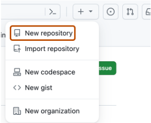
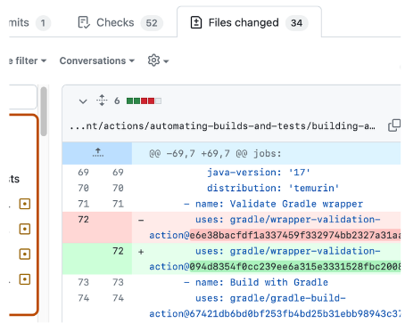
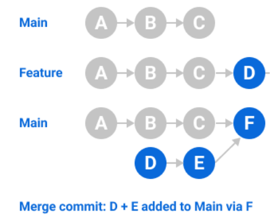
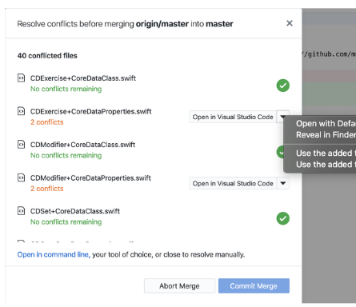
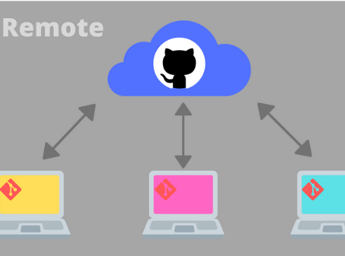

O objetivo desta aula é introduzir o que é controle de versão e, em seguida, introduxir o Git e o Github, explicando os principais conceitos e auxiliando no primeiro contato com as plataformas.

Abaixo, veja os professores e moderadores responsáveis por essa aula:

**Ministrantes da Aula**

| Papel | Apresentação | Nome |
| ----- | ------------ | ---- |
|Professora|| Bruna Böch|
|Professora|| Michelle |
|Moderadores|| Diego, Eduardo e Nicoly|

## O que é controle de versão?

Controle de versão é um sistema que registra alterações no desenvolvimento de software, permitindo que a equipe acesse o histórico de versões anteriores, recupere versões específicas e entenda mudanças feitas por outros. 

Ele facilita o trabalho em equipe e individual, possibilitando o registro de versões, codificação simultânea e integração segura e documentada de trabalhos. 

Um dos sistemas mais conhecidos e utilizados para controle de versão é o Git que, em conjunto com o GitHub se tornam ferramentas poderosas e didâticas para colaboração e armazenamento de projetos de software.

## Diferença entre Git e GitHub

Enquanto o Git é uma **ferramenta de controle de versão local**, o GitHub é uma **plataforma online que permite hospedar projetos Git e colaborar com outras pessoas**.

### Principais Conceitos

??? example "Repositório"

    - Onde os códigos são armazenados. 

    

??? example "Branch"

    - Permite que você isole o trabalho em diferentes linhas de desenvolvimento 

    

??? example "Commit"

    - Fazer uma “cópia” de segurança na sua máquina

    

??? example "Merge"

    - Combina diferentes branches. 

    

??? example "Conflicts"

    - Ocorrem quando há mudanças conflitantes que precisam ser resolvidas manualmente.

    

??? example "Remote"

    - É o que liga a sua máquina à plataforma online (GitHub).

    

??? example "Push e Pull"

    - Push: enviar da sua máquina para o GitHub através do Remote.

    

    - Pull: trazer do GitHub para sua máquina.

    

## Organizando e Instalando as Ferramentas Necessárias

Durante curso iremos utilizar algumas ferramentas e iremos apresentar cada uma delas para vocês.

Mas antes, bora instalá-las e realizar os passos necessários?

### Criando uma conta no GitHub

Clique [neste link](https://docs.github.com/pt/get-started/start-your-journey/creating-an-account-on-github) e siga o passo a passo!

### Instalando o Git

Assista [este vídeo]() com o passo a passo.

### Instalando o VSCode

Assista [este vídeo]() com o passo a passo.

### Instalando o GitHub Desktop

Assista [este vídeo]() com o passo a passo.

## De quais formas eu posso utilizar o GitHub

Existem várias ferramentas que permitem 

