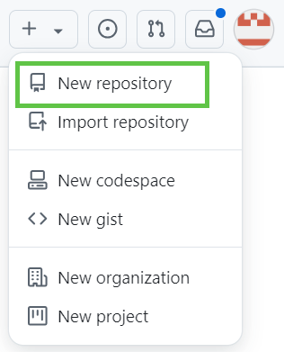
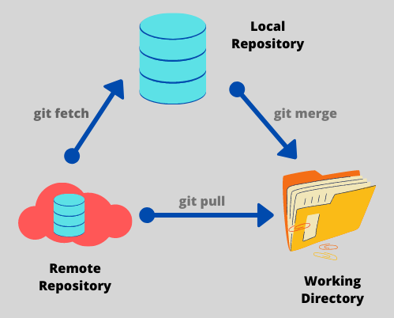
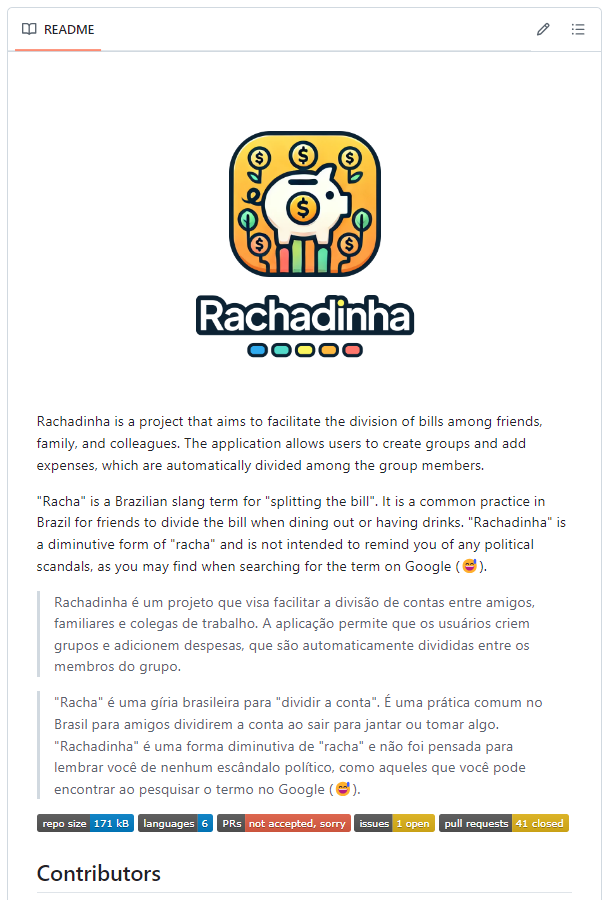
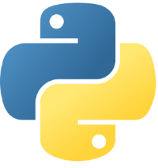
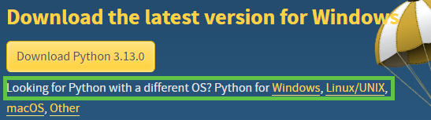
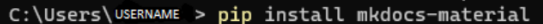

## Criando um Repositório

Um repositório é o **elemento mais básico do GitHub**. É um lugar onde você pode armazenar seu código, seus arquivos e o histórico de revisão de cada arquivo. Os repositórios podem ter vários colaboradores e podem ser públicos, internos ou particulares. 

Para criar um novo repositório, vá para [este link](https://github.com/new) ou, no canto superior direito de qualquer página do GitHub, selecione o "+" e clique em Novo repositório.

Em seguida, siga os passos abaixo:

1. Digite um nome breve para o repositório. Por exemplo, "olá mundo".

2. Opcionalmente, adicione uma descrição do repositório. Por exemplo, "Meu primeiro repositório no GitHub".

3. Escolha uma visibilidade do repositório. Para obter mais informações, [confira este link do GitHub Docs](https://docs.github.com/pt/enterprise-cloud@latest/repositories/creating-and-managing-repositories/about-repositories#about-repository-visibility).

4. Selecione Inicializar este repositório com um README.

5. Clique em Criar repositório.

Parabéns! Você criou seu primeiro repositório! <3.

!!! tip
    Caso queira aprender mais sobre criação de repositórios, acesse este [link](https://docs.github.com/pt/enterprise-cloud@latest/repositories/creating-and-managing-repositories/quickstart-for-repositories?tool=webui).

## Operações Git

### Clone

Ao criar um repositório no GitHub, ele existirá como um **repositório remoto**. É possível **clonar** o repositório para criar uma cópia local no seu computador e sincronizar entre os dois locais.

Ou seja, o clone é uma funcionalidade que permite baixar uma cópia completa dos dados de um repositório de GitHub.com, incluindo todas as versões de cada arquivo e pasta.

Quer saber mais sobre clonar repositórios e como isso pode ser feito? Acesse este [link do GitHub Docs](https://docs.github.com/pt/enterprise-cloud@latest/repositories/creating-and-managing-repositories/cloning-a-repository).

### Fork

O Fork permite a criação de **um novo repositório** que compartilha configurações de código e visibilidade com o repositório "upstream" original.

Quer saber mais sobre Fork e como isso pode ser feito? Acesse este [link do GitHub Docs](https://docs.github.com/pt/pull-requests/collaborating-with-pull-requests/working-with-forks/fork-a-repo).

!!! warning

    Atenção! 
    
    Durante a aula foi realizado um Fork de um repositório. Essa etapa foi importante pois criamos um novo repositório com arquivos que serão utilizados nas próximas aulas. Assim, caso tenha pardido esta aula ou não tenha conseguido acompanhar, assista a gravação que está disponível no início desta página.

### Fetch

O Fetch é um comando do Git que baixa as atualizações e mudanças feitas no repositório remoto (como novos commits, branches ou tags) para o repositório local, **sem integrá-las ao branch ativo**. Ele é especialmente útil para visualizar o que mudou no repositório remoto antes de aplicar essas mudanças no branch local.

Ao usar git fetch, o Git atualiza as referências do repositório remoto no seu ambiente local, permitindo que você veja as novas atualizações ou commits que foram adicionados ao repositório remoto. Essas mudanças ficam disponíveis para que você possa analisá-las e decidir se deseja incorporá-las ao seu branch por meio de um comando como git merge ou git rebase.

### Pull

O comando Pull no Git é usado para **sincronizar o repositório local com as últimas mudanças do repositório remoto**, trazendo novos commits e alterações diretamente para o seu branch atual. Ele funciona como uma combinação de dois comandos: git fetch (que baixa as mudanças do repositório remoto) seguido de git merge (que aplica essas mudanças no branch atual). Assim, git pull baixa e integra automaticamente as atualizações do repositório remoto.

#### Funcionamento do git pull

Quando você executa git pull, o Git:

- Baixa (fetch) as mudanças do repositório remoto.
  
- Faz um merge dessas mudanças no seu branch atual, integrando-as ao seu histórico.

!!! info

    Se houver conflitos entre as mudanças do repositório remoto e as mudanças locais, o Git solicitará que você resolva esses conflitos antes de concluir o merge.

Veja a imagem abaixo que resume e compara os dois últimos comandos: fetch e pull

### Push

O comando Push no Git é utilizado para enviar commits feitos no repositório local para o repositório remoto, atualizando-o com as mudanças feitas localmente. Em outras palavras, ele "empurra" as alterações do seu repositório local para um branch específico no repositório remoto, permitindo que outras pessoas ou sistemas possam acessar as novas atualizações.

#### Funcionamento do git push

Quando você executa git push, o Git:

- Identifica os commits que existem no repositório local, mas não no repositório remoto.
  
- Envia esses commits para o branch correspondente no repositório remoto, sincronizando-o com o seu repositório local.
  
!!! info

    É importante lembrar que, para executar um git push, você precisa ter permissão para modificar o repositório remoto. Além disso, você deve estar sincronizado com as mudanças do remoto (por exemplo, usando git pull) para evitar conflitos.

## Markdown

Outra ferramenta que exploramos durante a aula é a linguagem de marcação Markdown.

Essa linguagem permite adicionar formatação, links e imagens sem a necessidade de usar marcações mais complexas, como o HTML. 

O Markdown é baseado em linguagens de marcação anteriores, como setext, Textile e reStructuredText. Foi criado pelo blogueiro de tecnologia John Gruber e pelo programador Aaron Swartz. 

O Markdown é utilizado em vários sites, como o GitHub. Também é muito utilizada em arquivos do tipo README.

Confira [este site](https://www.markdownguide.org/basic-syntax/) com algumas dicas com relação ao uso do Markdown.

### README 

Você pode adicionar um arquivo README ao seu repositório para informar outras pessoas por que seu projeto é útil, o que elas podem fazer com o projeto e como elas podem usá-lo.

Este arquivo, junto com uma licença de repositório, um arquivo de citação, diretrizes de contribuição e um código de conduta, comunica as expectativas do projeto e ajuda você a gerenciar contribuições.

Veja abaixo um exemplo de README e como ele fica no repositório:

Clique [aqui](https://github.com/aprimeiradeads/agile-project-3a) para ver o readme acima completo.

!!! tip

    Veja [este link do GitHub Docs](https://docs.github.com/pt/repositories/managing-your-repositorys-settings-and-features/customizing-your-repository/about-readmes) para saber mais detalhes sobre README.

## Preparação para a GitHub Page

Com o intuito de já irmos deixando tudo organizado para a nossa GitHub Page, precisamos realizar mais alguns passos.

Nesta aula, iremos baixar o Python

!!! note

    Na aula 4 iremos nos aprofundar no uso e explicação dessa ferramenta.

Assim, siga os passos abaixo para realizar a instalação:

1. Clique [neste link](https://www.python.org/downloads/) para ser redirecionado ao site do Python.

2. Clique no botão abaixo da frase "Download the latest version for Windows", caso o seu sistema operacional seja Windows. Caso você possua outro sistema operacional, clique nos links fornecidos abaixo do botão e realize a instalação de acordo com o seu sistema.

3. Após intalar o Python, utilize este comando no seu terminal:

Após este passo, você finalizou a instalação necessária! :)
