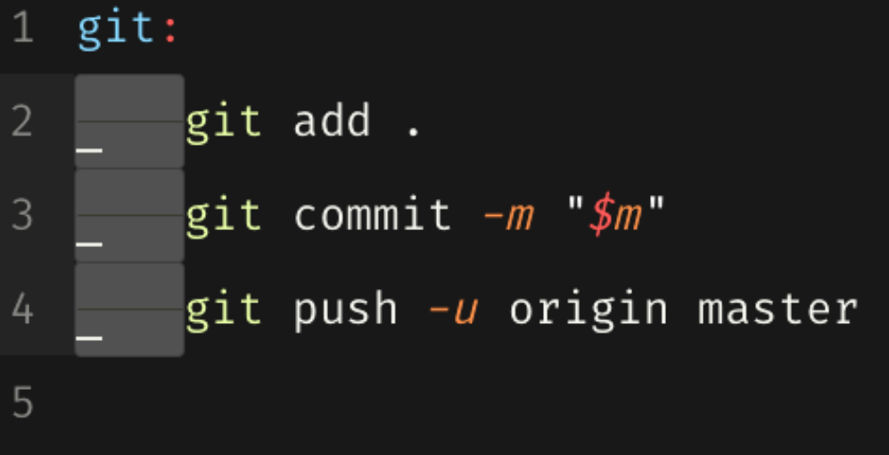

## Git Flow

O **Git Flow** é uma metodologia de gerenciamento de ramificações (branches) em projetos que utilizam o sistema de controle de versões Git. Foi introduzida por Vincent Driessen em 2010 e é amplamente utilizada para gerenciar o ciclo de desenvolvimento de software, especialmente em equipes que trabalham de forma colaborativa. A ideia central é definir um conjunto de regras para criar, gerenciar e mesclar branches, facilitando o fluxo de trabalho e a organização do código.

### Como o Git Flow funciona?

O Git Flow propõe o uso de 5 branches principais, cada uma com uma função específica:

1. **Main (ou master):**

Contém o código da versão estável e já em produção. Qualquer commit nessa branch deve ser uma versão pronta para ser lançada.

2. **Develop:**

Onde o desenvolvimento ativo acontece. Todos os recursos e funcionalidades são integrados aqui antes de serem lançados.

Serve como a base para as branches de feature, release e hotfix.

3. **Feature branches:**

Usadas para desenvolver novas funcionalidades. Derivam da branch develop e, ao serem concluídas, são mescladas de volta nela.

Nomenclatura: feature/nome-da-funcionalidade.

4. **Release branches:**

Usadas para preparar uma nova versão que será lançada. Derivam de develop e, quando prontas, são mescladas tanto em main quanto em develop.

Nomenclatura: release/x.y.z.

4. **Hotfix branches:**

Usadas para corrigir problemas críticos na produção. Derivam da main e, quando concluídas, são mescladas de volta tanto em main quanto em develop.

Nomenclatura: hotfix/x.y.z.

### Componentes do Git Flow

Para nos aprofundarmos um pouquinho mais no conteúdo, segue abaixo alguns componentes do Git Flow:

#### File Status

No Git Flow, o conceito de "file status" refere-se ao estado dos arquivos no seu repositório Git. Esse status indica o que o Git reconhece como alterações em relação à versão anterior. Em termos gerais, o estado de um arquivo pode ser:

- Untracked (Não rastreado);
- Unmodified (Não modificado);
- Modified (Modificado);
- Staged (Preparado para commit)

Abaixo vamos detalhar cada um destes estados, explicando o ciclo de vida de um arquivo no contexto do Git Flow.

??? example "Untracked (Não rastreado)"
    
    Arquivos que o Git ainda não está monitorando. Quando você cria um novo arquivo, ele começa como untracked.
    
    Para começar a rastrear esse arquivo, você precisa usar o comando:

    `git add <arquivo>`

??? example "Unmodified (Não modificado)"
    
    Arquivos que já estão sendo rastreados e não foram alterados desde o último commit. O Git considera esses arquivos sincronizados com o repositório.
    
    Não há necessidade de qualquer ação se você não fez alterações neles.

??? example "Modified (Modificado)"

    Arquivos que foram alterados, mas as mudanças ainda não foram adicionadas à área de stage.
    
    Para ver quais arquivos estão modificados, você pode usar:

    `git status`
    
    Para mover um arquivo modificado para a área de stage (preparando-o para commit):

    `git add <arquivo>`

??? example "Staged (Preparado para commit)"
    
    Arquivos que foram modificados e adicionados à área de stage com o comando git add.
    
    Esses arquivos estão prontos para serem salvos no próximo commit.
    
    Para fazer o commit das alterações staged:

    `git commit -m "Mensagem do commit"`

Veja este resumo:

#### Commits

Um **commit** no Git é como uma "fotografia" do estado atual do seu projeto. Ele registra todas as alterações feitas nos arquivos rastreados, criando um ponto no histórico do repositório que pode ser recuperado posteriormente. Cada commit tem uma mensagem descritiva associada, que explica as alterações feitas, facilitando o entendimento do histórico do projeto.

Em termos simples, um commit é:

- Um ponto de restauração no desenvolvimento, permitindo voltar a estados anteriores, se necessário.
- Uma maneira de documentar seu trabalho e comunicar mudanças para outros desenvolvedores.
- Um elemento básico para o versionamento e a colaboração em projetos.

**Como Fazer um Commit no Git?**

#### Branches

No Git, uma **branch (ramificação)** é uma linha independente de desenvolvimento. Imagine que uma branch é como um caminho paralelo ao "tronco" principal do seu projeto, permitindo que você trabalhe em novas funcionalidades, correções de bugs ou experimentos, sem interferir diretamente no código existente. Cada branch possui seu próprio histórico de commits, que pode eventualmente ser mesclado (merged) de volta ao tronco principal ou descartado, dependendo da necessidade.

Em outras palavras, branchs ajudam a isolar mudanças para que você possa trabalhar em várias tarefas ao mesmo tempo, sem interferir nas partes estáveis do seu projeto.

Acesse [este link](https://git-scm.com/book/pt-br/v2/Branches-no-Git-Branches-em-poucas-palavras) do site do git para saber mais.

## Trabalhando com Colaboração

No desenvolvimento de software, colaboração é essencial, especialmente em projetos de código aberto ou em equipes distribuídas. 

O Git, junto com a plataforma GitHub, fornece várias ferramentas que facilitam essa colaboração. 

Abaixo, vamos detalhar dois dos principais mecanismos: **Pull Requests e Issues**, que ajudam equipes a colaborar de forma eficiente, revisando código, discutindo melhorias e rastreando problemas.

### Pull Requests

**Pull Requests** (PRs) são uma forma de propor alterações em um projeto, permitindo que outros membros da equipe revisem e aprovem essas mudanças antes que elas sejam mescladas na branch principal (geralmente main ou develop). 

Esse processo é especialmente útil em projetos colaborativos e em código aberto, pois garante que o código seja revisado e testado antes de ser integrado.

#### Como Funcionam os Pull Requests:

??? example "1. Criação da Branch:"

    O colaborador cria uma branch separada para trabalhar em uma nova funcionalidade ou correção de bug.

    git checkout -b feature/minha-nova-funcionalidade

??? example "2. Fazer Alterações e Commits:""

    O colaborador faz alterações no código e faz os commits necessários.

    git commit -m "Implementa nova funcionalidade"

??? example "3. Enviar a Branch para o Repositório Remoto:"

    Quando estiver pronto, ele faz o push da branch para o repositório remoto.

    git push origin feature/minha-nova-funcionalidade

??? example "4. Abrir um Pull Request:"

    O colaborador abre um Pull Request na plataforma de controle de versão (ex.: GitHub), selecionando a branch que deseja mesclar.

    Inclui uma descrição detalhada das mudanças, o motivo por trás delas e qualquer informação adicional necessária para revisão.

??? example "5. Revisão e Aprovação:"

    Outros desenvolvedores revisam o código, fazem comentários, sugerem alterações ou aprovam o PR.
    
    Caso necessário, o autor pode fazer ajustes e atualizar o PR com novos commits.

??? example "6. Mesclar o PR:"

    Após a aprovação, o PR é mesclado na branch principal.
    
    Dependendo das políticas do projeto, isso pode ser feito automaticamente ou por um maintainer.

!!! success "Vantagens dos Pull Requests:"

  - Revisão de código antes de integrar mudanças;
  - Discussão colaborativa para melhorar a qualidade do código;
  - 0Histórico claro de alterações e melhorias.

### Issues

**Issues** são uma forma de rastrear problemas, bugs, sugestões de melhorias e tarefas em um projeto. Elas são especialmente úteis para documentar o que precisa ser feito, tanto por desenvolvedores quanto por outros membros da equipe, como gerentes de projeto ou designers.

Clique nessa [documentação do GitHub Docs](https://docs.github.com/pt/issues/tracking-your-work-with-issues/about-issues) para saber mais sobre o que é uma Issue.

#### Como criar uma Issue?

Clique nessa [documentação do GitHub Docs](https://docs.github.com/pt/issues/tracking-your-work-with-issues/using-issues/creating-an-issue) para saber como criar uma Issue.

!!! success "Vantagens do Uso de Issues:"

    - Rastreiam bugs e tarefas de forma organizada;
    - Facilitam a comunicação entre os membros da equipe;
    - Ajudam a priorizar o trabalho e gerenciar o backlog do projeto.
