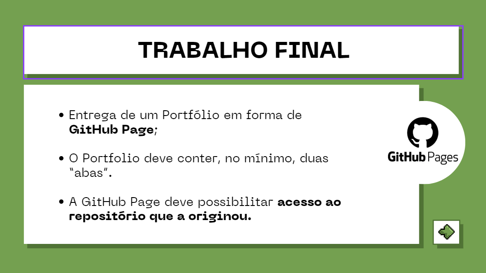
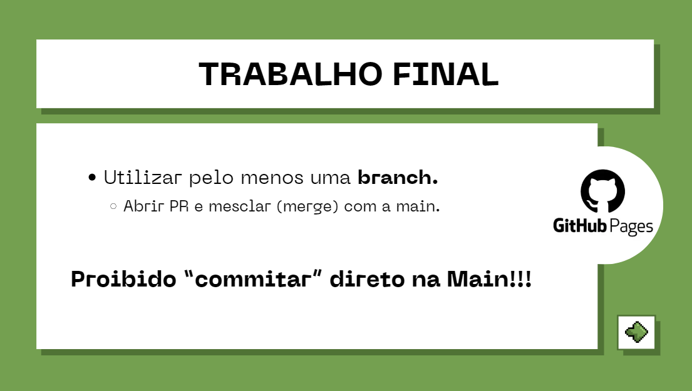
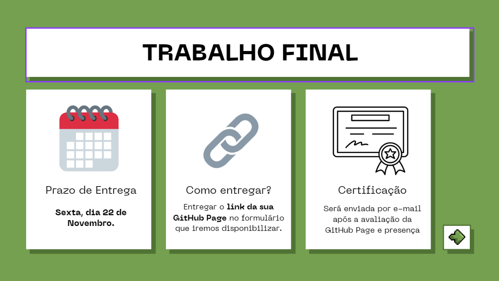

Para atingir a certificação do curso, é importante que você tenha participado de, ao menos, 3 aulas.

Além disso, um trabalho final (link de um GitHub Page em forma de Portfolio) que deve ser entregue até dia **22 de Novembro de 2024 (sexta-feira)**. Veja abaixo mais detalhes do trabalho.

## Entrega

!!! tip "Onde entregar o trabalho?"

    Entregue o trabalho através deste [formulário](https://forms.gle/trZCR2jVgJ2kLCHo8).